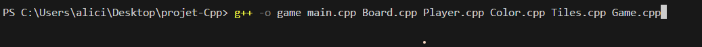
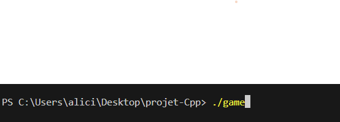
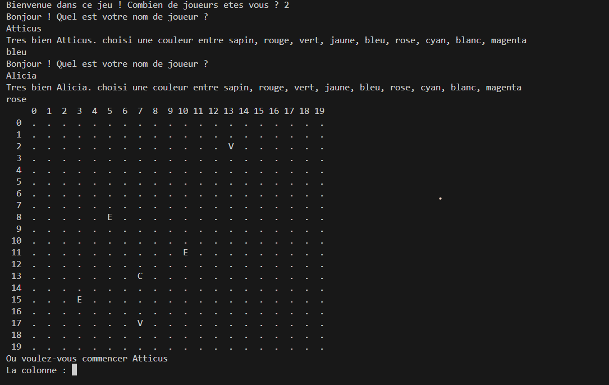
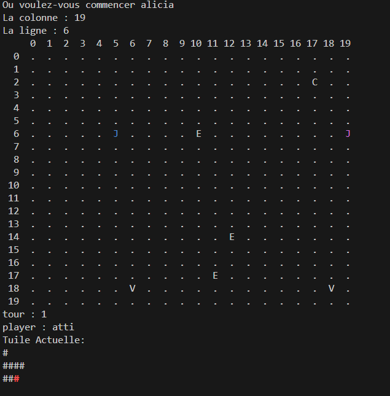
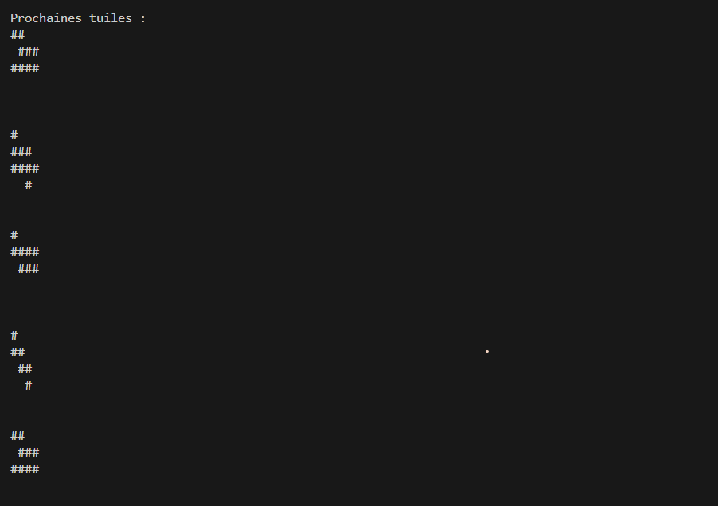
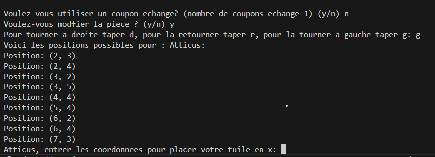
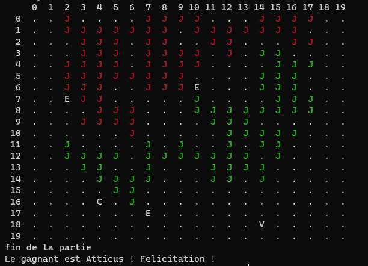

# 👨🏻‍💻 Projet

🕹️ **Laying Grass** est un projet du module C++ de deuxième année. Il est insipiré du jeu **"Laying Grass"** de la série **"The Devil's Plan"** de la platform Netflix. . Notre projet a été développé dans le cadre d’un travail étudiant à Supinfo et repose sur les concepts abordés pendant le cours, avec quelques recherches complémentaires. "Laying Grass" est un jeu stratégique dans lequel les joueurs posent des tuiles d'herbe sur une grille afin d'étendre leur territoire et de créer le plus grand carré possible.

# 💡 Usage

Pour le compiler : g++ -o game main.cpp
Pour l'executer une fois compiler : .\game.exe

# 📂 Documentation Technique

**:art: Color**

```c++
    std::map<std::string, std::string> allColors;
    void showColorizedText(std::string text);
    Color();
    void askColor();
    void initColors();
    std::string getColorName();
    ~Color();
```

- **allColors**: attribut public, c'est un dictionnaire qui assosie le nom d'une couleur a son numéro pour le FG.
- **initColors**: Fonction qui permet d'initialisé la couleur pour chaque joueur grâce à l'attribut **allColors**.
- **getColorName**: Getter permettant d'avoir le nom de la couleur.
- **askColor**: Fonction demandant aux joueurs d'entrer leurs couleurs.
- **showColorizedText**: Foction qui permet de colorier le texte désirer de la couleur choisi par l'utilisateur.
- **Color** et **~Color**: Constructeur et destruceur de la class.

**🕹️ Player**

```c++
    void setMaxSize(int max);
    void setSquareMax(int max);
    Player(int id);
    void setTitleExchange(int value);
    void displayPlayerInfo();
```

- **setMaxSize**: Setter qui prend en paramètre _"max_. Il permet definir valeur de _"maxSize"_ qui sera égal à _"max"_.
- **setSquareMax**: Setter qui prend en paramètre _"max_. Il permet definir valeur de _"squareSize"_ qui sera égal à _"max"_.
- **Player**: Constructeur, il crée le joueur en lui demandant son nom et sa couleur et set ses bonus.
- **setTitleExchange**: Setter qui prend en paramètre _"value_. Il permet definir valeur de _"tileExchange"_ qui sera égal à _"value"_.
- **displayPlayerInfo**: Fonction permettant de voir le nom du joueur, sa couleur et son nombre de bonus.

**:clapper: Board**

```c++
    void initBoard(int numbersOfPlayer);
    void displayBoard(std::vector<Player> listOfPlayer);
    std::pair<int, int> randomNumber();
    void implementeCaseBonus(int numbersOfPlayer);
```

- **initBoard**: Fonction qui initialise le tableau. Le paramètre _"numbersOfPlayer"_ permet de changer la taille du tableau en fonction du nombre de joueurs.
- **displayBoard**: Fonction qui permet d'affichier le tableau. Il affiche les bonus par V,E ou C. Le joueur quant a lui sera affiché par un J de sa couleur.
- **randomNumber**: Fonction qui permet de _return_ deux nombre aléatoire.
- **implementeCaseBonus**: Fonction qui ajoute de façon aléatoire des cases bonus sur le tableau. Le nombre de bonus est calculé selon le nombre de joueurs.

**:bricks: Tiles**

```c++
    void SetTiles();
    void SetRandomTile();
    void popFirstTile();
```

- **SetTiles**: Fonction qui ajoute toutes les tuiles.
- **SetRandomTile**: Fonction qui mélange l'ordre des tuiles de façon aléatoire.
- **popFirstTile**: Supprime la tuile qui se trouve en premier position dans la liste.

**:video_game: Game**

```c++
        void run();
        void initGamePlayer(int numberOfPlayer);
        void firstTile(int idPlayerBoard, int player);
        void DisplayCurrentTile();
        void rotate90();
        bool canPlaceTile(int centerX, int centerY, int idPlayer);
        void PlaceTile(int centerX, int centerY, int idPlayer);
        void extraBonus(int player,int idPlayer);
        void displayTiles();
        void printPossiblePositions(int idPlayer, int player);
        void Winner();
        bool isStoneSquareActivated(int idPlayer);
        void placeStoneTile();
        bool useExchangeCoupon(int player);
        void reorganizeTiles(int chosenTileIndex);
        bool isExchangeSquareActivated(int idPlayer);
        void activeExchange(int player, int idPlayer);
        bool isRobberryActivated(int idPlayer);
        void activeRobery(int player, int idPlayer);
```

- **run**: Fonction qui sert a faire tourner le jeu.
- **initGamePlayer**: Fonction qui ajouté le joueur a une liste de joueur.
- **firstTile**: Fonction qui permet a chaque joueur de poser leurs tuiles de départ.
- **DisplayCurrentTile**: Fonction qui montre la tuile que le joueur doit placer.
- **rotate90**: La tuile peut être manipuler dans plusieurs sens. La fonction permet de faire bouger celle-ci de 90°.
- **canPlaceTile** : Permet de vérifier si le joueur peut placer sa tuile.
- **PlaceTile**: Place la tuile sur le plateau.
- **extraBonus**: Tant que le joueur a des coupons d'échange il peut placer des tuiles de 1x1.
- **displayTiles**: Fonction qui montre les prochaine tuiles a jouer.
- **printPossiblePositions**: Fonction qui écrit les differentes possibilité de placement.
- **Winner**: Fonction qui gère les conditions de victoire.
- **isStoneSquareActivated**: Fonction qui vérifie que le bonus Stone est entouré ou non.
- **placeStoneTile**: Fonction qui place un bloc sur le quel aucun joueur ne peut poser une tuile.
- **useExchangeCoupon** : Fonction qui permet de verifier si le joueur a des coupons d'échange.
- **reorganizeTiles**: Fonction qui reorganise les tuiles.
- **isExchangeSquareActivated**: Fonction qui vérifie si le bonus d'échange est entouré.
- **activeExchange**: Fonction qui ajoute un coupon d'échange.
- **isRobberryActivated**: Fonction qui vérifie si le bonus Vol est entouré.
- **activeRobery**: Fonction qui permet au joueur de jouer sur la case d'un autre.

**Main**

```c++
    srand(time(0));
    game.run();
```

- **srand**: Permet au random de changer.
- **game.run**: Lance la partie.

# 📂 Documentation Utilisateur

**Nombre de joueurs**: _2_ à _9_.
**Dimensions de la grille**: _20x20_ pour _2_ à _4_ joueurs, _30x30_ pour _5_ à _9_ joueurs.
**Objectif**: Couvrir _la plus grande zone carrée possible_. En cas d'égalité, le joueur ayant _le plus de tuiles d'herbe_ gagne.

**Règles**

- La première tuile d’un joueur doit toucher sa tuile de départ.
- Toutes les tuiles suivantes doivent être connectées au territoire déjà existant du joueur, en touchant au **moins un côté d’une tuile appartenant au territoire**.
- Les tuiles peuvent être _pivotées_ ou _retournées_, mais elles **ne peuvent pas se chevaucher** ni **être placées sur les territoires des autres joueurs**.
- Une tuile placée ne peut pas être déplacée.
- Si un joueur ne peut pas placer sa tuile, elle est défaussée et il passe son tour.
- En utilisant un coupon d'**Échange**, un joueur peut choisir une tuile parmi les 5 suivantes au lieu de prendre la première disponible dans la file.
- En utilisant le bonus **Stone** le joueur peut placer une case ou personne ne pourra jouer. (A utilisé dès la récuperation).
- En utilisant un coupon **Vol** le joueur peut placer une tuile de 1x1 sur le territoire d'un joueur adverse. (A utilisé dès la récuperation).
- Pour récuprer un bonus, le joueur doit entouré la case par les 4 points cardinaux. En cas de cheuvauchement le bonus est perdu.

**Cases Spéciales**

- Les cases marquer par un E sont les cases bonus Échange. Elle rajoute +1 coupon d'échange au joueur.
- Les cases marquer par un S sont les cases bonus Stone.
- Les cases marquer par un V sont les bonus Vol.
- Les cases marquer par un N sont des cases bonus utilsé. Elles sont compté comme neutre.
- Les cases des joueurs sont marquer par un J de la couleur choisi par le joueur.

**Creation d'une partie**
Pour démarrer rentrer cette commande :

suivit de celle-ci:

Ensuite, le jeu vous demandera de rentrer un nombre de joueur. Leurs noms et leurs couleurs.

Une fois les joueurs crée vous deverez definir leurs zones de début. En plaçant leurs tuiles de 1x1.
Le tableau s'affichera avec un J de la couleur de votre joueur. Une fois ces tuiles placer, le premier tour commence.

La tuile que vous chercherez a placer s'affichera en dessous du tableau avec la liste des tuiles suivantes.

Vous aurez ensuite le choix d'échanger la pièce avec une de la file d'attente. Puis si vous voulez tourner la pièce a gauche, la retourner, ou la tourner vers la droite.

Les possibilités de placement seront écrite afin de vous aider. De plus, les coordonés qui vous sont demandé est celle du # rouge ou du point rouge qui vous sert de repère. Vous n'aurez plus qu'a rentré votre colonne puis la ligne.

La partie se termine après 9 tours.
À la fin, les joueurs peuvent utiliser leurs coupons d’échange pour acheter des tuiles 1x1 supplémentaires et les placer sur la grille.
Le gagnant est le joueur avec le plus grand carré. En cas d’égalité, le joueur ayant le plus de tuiles gagne.


# 🫂 Groupes

- Atticus AUERBACH
- Alicia MARTIN PRUDHON
